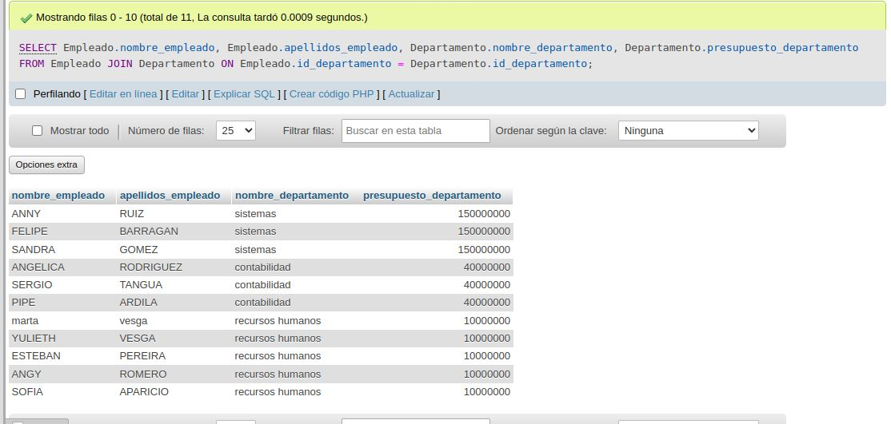

# consultas_2
 
 
 

# obtener apellidos 
SELECT apellidos_empleado FROM Empleado;
 

# que no se repita apellidos 

SELECT DISTINCT apellidos_empleado FROM Empleado;
 

#  apellidos  gomez 
SELECT DISTINCT apellidos_empleado 
FROM Empleado
WHERE apellidos_empleado = 'Gomez';
 

# Obtener todos los datos de los empleados que se apellidan "Diaz" y los que se apellidan "Rodriguez".  Usar OR o IN

SELECT * 
FROM Empleado
WHERE apellidos_empleado = 'Diaz' OR apellidos_empleado = 'Rodriguez';
 

# Obtener los nombres de los empleados que trabajan en el departamento 11
SELECT nombre_empleado FROM Empleado WHERE id_departamento = 11;
 

# Obtener todos los datos de los empleados cuyo apellido empiece por 'P'
SELECT * FROM Empleado WHERE apellidos_empleado LIKE 'P%';
 

# Obtener el presupuesto total de todos los departamentos.
SELECT SUM(presupuesto_departamento) AS presupuesto_total FROM Departamento;
 

# Obtener el número de empleados de cada departamento.

 

# Obtener un listado completo de empleados, incluyendo por cada empleado los datos del empleado y de su departamento.

 

# Obtener un listado completo de empleados, incluyendo el nombre y apellidos del empleado junto al nombre y presupuesto de su departamento.

 

# Obtener los nombres y apellidos de los empleados que trabajen en departamentos cuyo presupuesto sea mayor a 100000000

 
